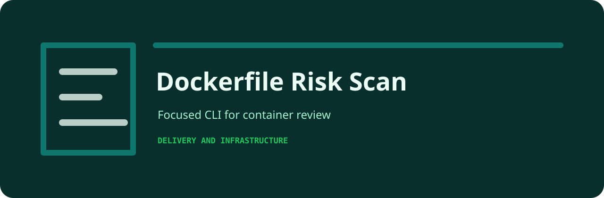

# Dockerfile Risk Scan

Scan Dockerfile snippets for root users, latest tags, and unpinned installs.

   

## Workflow

1. Collect the review notes or exported records.
2. Run `dockerfile-risk-scan` against the file.
3. Read the findings in Markdown, or switch to JSON for automation.
4. Fail CI only at the severity level you care about.

## Checks

| Rule | Severity | What it catches |
| --- | --- | --- |
| `latest-tag` | high | base image uses latest tag |
| `root-user` | medium | container runs as root |
| `unpinned-pip` | low | pip dependency may be unpinned |

## Command line

```bash
python -m pip install -e ".[dev]"
dockerfile-risk-scan examples/sample.txt
dockerfile-risk-scan examples/sample.txt --json --fail-on medium
```

## Sample risky input

```text
FROM python:latest RUN pip install flask USER root
```

## Project shape

```text
.github/        CI workflow
examples/       sample inputs
src/            package source
tests/          test coverage
.gitignore      project file
pyproject.toml  package metadata
```
