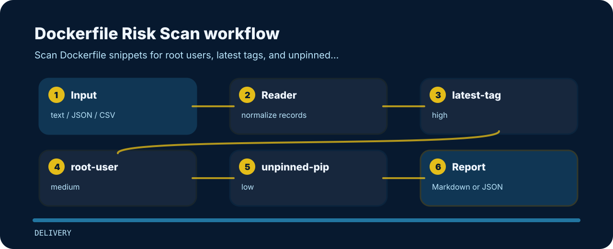

# Dockerfile Risk Scan


This repository turns a tiny plain text into reviewable signals for container review.

## How the check reads



## Checks in plain language

| Signal | Level | What it flags | Fix direction |
| --- | --- | --- | --- |
| `latest-tag` | high | base image uses latest tag | Pin base image version or digest. |
| `root-user` | medium | container runs as root | Use a non-root runtime user. |
| `unpinned-pip` | low | pip dependency may be unpinned | Pin runtime dependencies or use a lockfile. |

## Fresh clone path

```bash
git clone https://github.com/mertefekurt/dockerfile-risk-scan.git
cd dockerfile-risk-scan
python -m pip install -e ".[dev]"
dockerfile-risk-scan examples/sample.txt
```

## Example lines

```text
risky: FROM python:latest RUN pip install flask USER root
clean: FROM python:3.11-slim RUN pip install flask==3.0.0 USER app
```
